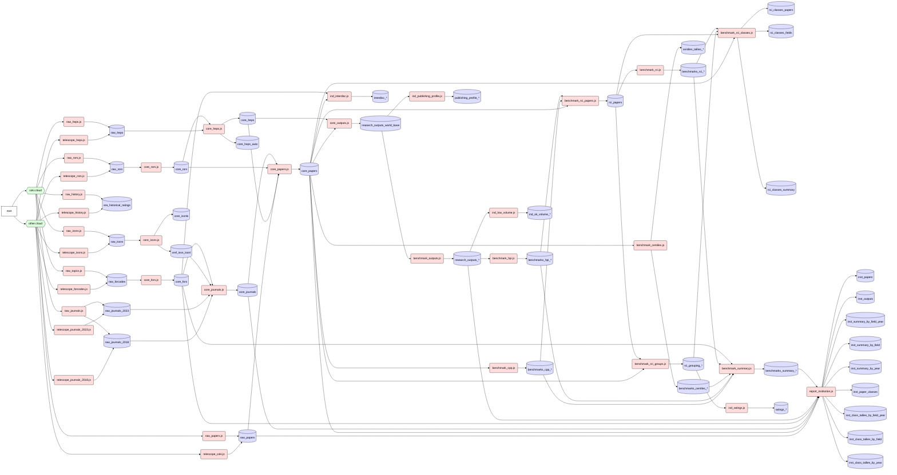

```mermaid
%%{ init: { "theme":"forest", "themeVariables": { "fontFamily" : "helvetica" }}}%%
graph LR
  classDef table   fill:#DDF,stroke:#000;
  classDef file    fill:#DFD,stroke:#000;
  classDef exec    fill:#FDD,stroke:#000;
  classDef default fill:#FFF,stroke:#000;
  root --> coki.cloud{{coki.cloud}}:::file
  root --> other.cloud{{other.cloud}}:::file
  other.cloud{{other.cloud}}:::file --> telescope_coki.js(telescope_coki.js):::exec
  telescope_coki.js(telescope_coki.js):::exec --> raw_papers[(raw_papers)]:::table
  other.cloud{{other.cloud}}:::file --> telescope_forcodes.js(telescope_forcodes.js):::exec
  telescope_forcodes.js(telescope_forcodes.js):::exec --> raw_forcodes[(raw_forcodes)]:::table
  other.cloud{{other.cloud}}:::file --> telescope_heps.js(telescope_heps.js):::exec
  telescope_heps.js(telescope_heps.js):::exec --> raw_heps[(raw_heps)]:::table
  other.cloud{{other.cloud}}:::file --> telescope_history.js(telescope_history.js):::exec
  telescope_history.js(telescope_history.js):::exec --> era_historical_ratings[(era_historical_ratings)]:::table
  other.cloud{{other.cloud}}:::file --> telescope_issns.js(telescope_issns.js):::exec
  telescope_issns.js(telescope_issns.js):::exec --> raw_issns[(raw_issns)]:::table
  other.cloud{{other.cloud}}:::file --> telescope_journals_2018.js(telescope_journals_2018.js):::exec
  telescope_journals_2018.js(telescope_journals_2018.js):::exec --> raw_journals_2018[(raw_journals_2018)]:::table
  other.cloud{{other.cloud}}:::file --> telescope_journals_2023.js(telescope_journals_2023.js):::exec
  telescope_journals_2023.js(telescope_journals_2023.js):::exec --> raw_journals_2023[(raw_journals_2023)]:::table
  other.cloud{{other.cloud}}:::file --> telescope_rors.js(telescope_rors.js):::exec
  telescope_rors.js(telescope_rors.js):::exec --> raw_rors[(raw_rors)]:::table
  core_papers[(core_papers)]:::table --> benchmark_centiles.js(benchmark_centiles.js):::exec
  benchmark_centiles.js(benchmark_centiles.js):::exec --> benchmarks_centiles_*[(benchmarks_centiles_*)]:::table
  benchmark_centiles.js(benchmark_centiles.js):::exec --> centiles_tallies_*[(centiles_tallies_*)]:::table
  core_papers[(core_papers)]:::table --> benchmark_cpp.js(benchmark_cpp.js):::exec
  benchmark_cpp.js(benchmark_cpp.js):::exec --> benchmarks_cpp_*[(benchmarks_cpp_*)]:::table
  research_outputs_*[(research_outputs_*)]:::table --> benchmark_hpi.js(benchmark_hpi.js):::exec
  benchmark_hpi.js(benchmark_hpi.js):::exec --> benchmarks_hpi_*[(benchmarks_hpi_*)]:::table
  research_outputs_world_base[(research_outputs_world_base)]:::table --> benchmark_outputs.js(benchmark_outputs.js):::exec
  benchmark_outputs.js(benchmark_outputs.js):::exec --> research_outputs_*[(research_outputs_*)]:::table
  rci_papers[(rci_papers)]:::table --> benchmark_rci.js(benchmark_rci.js):::exec
  benchmark_rci.js(benchmark_rci.js):::exec --> benchmarks_rci_*[(benchmarks_rci_*)]:::table
  core_papers[(core_papers)]:::table --> benchmark_rci_classes.js(benchmark_rci_classes.js):::exec
  rci_papers[(rci_papers)]:::table --> benchmark_rci_classes.js(benchmark_rci_classes.js):::exec
  rci_grouping_*[(rci_grouping_*)]:::table --> benchmark_rci_classes.js(benchmark_rci_classes.js):::exec
  benchmarks_rci_*[(benchmarks_rci_*)]:::table --> benchmark_rci_classes.js(benchmark_rci_classes.js):::exec
  benchmark_rci_classes.js(benchmark_rci_classes.js):::exec --> rci_classes_papers[(rci_classes_papers)]:::table
  benchmark_rci_classes.js(benchmark_rci_classes.js):::exec --> rci_classes_fields[(rci_classes_fields)]:::table
  benchmark_rci_classes.js(benchmark_rci_classes.js):::exec --> rci_classes_summary[(rci_classes_summary)]:::table
  core_papers[(core_papers)]:::table --> benchmark_rci_groups.js(benchmark_rci_groups.js):::exec
  rci_papers[(rci_papers)]:::table --> benchmark_rci_groups.js(benchmark_rci_groups.js):::exec
  benchmark_rci_groups.js(benchmark_rci_groups.js):::exec --> rci_grouping_*[(rci_grouping_*)]:::table
  core_papers[(core_papers)]:::table --> benchmark_rci_papers.js(benchmark_rci_papers.js):::exec
  benchmarks_cpp_*[(benchmarks_cpp_*)]:::table --> benchmark_rci_papers.js(benchmark_rci_papers.js):::exec
  benchmarks_hpi_*[(benchmarks_hpi_*)]:::table --> benchmark_rci_papers.js(benchmark_rci_papers.js):::exec
  benchmark_rci_papers.js(benchmark_rci_papers.js):::exec --> rci_papers[(rci_papers)]:::table
  benchmarks_cpp_*[(benchmarks_cpp_*)]:::table --> benchmark_summary.js(benchmark_summary.js):::exec
  benchmarks_hpi_*[(benchmarks_hpi_*)]:::table --> benchmark_summary.js(benchmark_summary.js):::exec
  benchmarks_centiles_*[(benchmarks_centiles_*)]:::table --> benchmark_summary.js(benchmark_summary.js):::exec
  benchmarks_rci_*[(benchmarks_rci_*)]:::table --> benchmark_summary.js(benchmark_summary.js):::exec
  core_fors[(core_fors)]:::table --> benchmark_summary.js(benchmark_summary.js):::exec
  benchmark_summary.js(benchmark_summary.js):::exec --> benchmarks_summary_*[(benchmarks_summary_*)]:::table
  raw_forcodes[(raw_forcodes)]:::table --> core_fors.js(core_fors.js):::exec
  core_fors.js(core_fors.js):::exec --> core_fors[(core_fors)]:::table
  raw_heps[(raw_heps)]:::table --> core_heps.js(core_heps.js):::exec
  core_rors[(core_rors)]:::table --> core_heps.js(core_heps.js):::exec
  core_heps.js(core_heps.js):::exec --> core_heps[(core_heps)]:::table
  core_heps.js(core_heps.js):::exec --> core_heps_auto[(core_heps_auto)]:::table
  raw_issns[(raw_issns)]:::table --> core_issns.js(core_issns.js):::exec
  core_issns.js(core_issns.js):::exec --> core_issnls[(core_issnls)]:::table
  core_issns.js(core_issns.js):::exec --> xref_issn_issnl[(xref_issn_issnl)]:::table
  raw_journals_2018[(raw_journals_2018)]:::table --> core_journals.js(core_journals.js):::exec
  raw_journals_2023[(raw_journals_2023)]:::table --> core_journals.js(core_journals.js):::exec
  xref_issn_issnl[(xref_issn_issnl)]:::table --> core_journals.js(core_journals.js):::exec
  core_fors[(core_fors)]:::table --> core_journals.js(core_journals.js):::exec
  core_journals.js(core_journals.js):::exec --> core_journals[(core_journals)]:::table
  core_papers[(core_papers)]:::table --> core_outputs.js(core_outputs.js):::exec
  core_heps[(core_heps)]:::table --> core_outputs.js(core_outputs.js):::exec
  core_outputs.js(core_outputs.js):::exec --> research_outputs_world_base[(research_outputs_world_base)]:::table
  raw_papers[(raw_papers)]:::table --> core_papers.js(core_papers.js):::exec
  core_heps[(core_heps)]:::table --> core_papers.js(core_papers.js):::exec
  core_rors[(core_rors)]:::table --> core_papers.js(core_papers.js):::exec
  core_journals[(core_journals)]:::table --> core_papers.js(core_papers.js):::exec
  core_papers.js(core_papers.js):::exec --> core_papers[(core_papers)]:::table
  raw_rors[(raw_rors)]:::table --> core_rors.js(core_rors.js):::exec
  core_rors.js(core_rors.js):::exec --> core_rors[(core_rors)]:::table
  core_papers[(core_papers)]:::table --> ind_interdisc.js(ind_interdisc.js):::exec
  core_fors[(core_fors)]:::table --> ind_interdisc.js(ind_interdisc.js):::exec
  ind_interdisc.js(ind_interdisc.js):::exec --> interdisc_*[(interdisc_*)]:::table
  research_outputs_*[(research_outputs_*)]:::table --> ind_low_volume.js(ind_low_volume.js):::exec
  ind_low_volume.js(ind_low_volume.js):::exec --> ind_ok_volume_*[(ind_ok_volume_*)]:::table
  research_outputs_world_base[(research_outputs_world_base)]:::table --> ind_publishing_profile.js(ind_publishing_profile.js):::exec
  ind_publishing_profile.js(ind_publishing_profile.js):::exec --> publishing_profile_*[(publishing_profile_*)]:::table
  rci_grouping_*[(rci_grouping_*)]:::table --> ind_ratings.js(ind_ratings.js):::exec
  ind_ratings.js(ind_ratings.js):::exec --> ratings_*[(ratings_*)]:::table
  coki.cloud{{coki.cloud}}:::file --> raw_heps.js(raw_heps.js):::exec
  raw_heps.js(raw_heps.js):::exec --> raw_heps[(raw_heps)]:::table
  coki.cloud{{coki.cloud}}:::file --> raw_history.js(raw_history.js):::exec
  raw_history.js(raw_history.js):::exec --> era_historical_ratings[(era_historical_ratings)]:::table
  coki.cloud{{coki.cloud}}:::file --> raw_issns.js(raw_issns.js):::exec
  raw_issns.js(raw_issns.js):::exec --> raw_issns[(raw_issns)]:::table
  coki.cloud{{coki.cloud}}:::file --> raw_journals.js(raw_journals.js):::exec
  raw_journals.js(raw_journals.js):::exec --> raw_journals_2018[(raw_journals_2018)]:::table
  raw_journals.js(raw_journals.js):::exec --> raw_journals_2023[(raw_journals_2023)]:::table
  coki.cloud{{coki.cloud}}:::file --> raw_papers.js(raw_papers.js):::exec
  raw_papers.js(raw_papers.js):::exec --> raw_papers[(raw_papers)]:::table
  coki.cloud{{coki.cloud}}:::file --> raw_rors.js(raw_rors.js):::exec
  raw_rors.js(raw_rors.js):::exec --> raw_rors[(raw_rors)]:::table
  coki.cloud{{coki.cloud}}:::file --> raw_topics.js(raw_topics.js):::exec
  raw_topics.js(raw_topics.js):::exec --> raw_forcodes[(raw_forcodes)]:::table
  raw_papers[(raw_papers)]:::table --> report_institution.js(report_institution.js):::exec
  core_papers[(core_papers)]:::table --> report_institution.js(report_institution.js):::exec
  core_journals[(core_journals)]:::table --> report_institution.js(report_institution.js):::exec
  core_fors[(core_fors)]:::table --> report_institution.js(report_institution.js):::exec
  research_outputs_*[(research_outputs_*)]:::table --> report_institution.js(report_institution.js):::exec
  benchmarks_summary_*[(benchmarks_summary_*)]:::table --> report_institution.js(report_institution.js):::exec
  report_institution.js(report_institution.js):::exec --> inst_papers[(inst_papers)]:::table
  report_institution.js(report_institution.js):::exec --> inst_outputs[(inst_outputs)]:::table
  report_institution.js(report_institution.js):::exec --> inst_summary_by_field_year[(inst_summary_by_field_year)]:::table
  report_institution.js(report_institution.js):::exec --> inst_summary_by_field[(inst_summary_by_field)]:::table
  report_institution.js(report_institution.js):::exec --> inst_summary_by_year[(inst_summary_by_year)]:::table
  report_institution.js(report_institution.js):::exec --> inst_paper_classes[(inst_paper_classes)]:::table
  report_institution.js(report_institution.js):::exec --> inst_class_tallies_by_field_year[(inst_class_tallies_by_field_year)]:::table
  report_institution.js(report_institution.js):::exec --> inst_class_tallies_by_field[(inst_class_tallies_by_field)]:::table
  report_institution.js(report_institution.js):::exec --> inst_class_tallies_by_year[(inst_class_tallies_by_year)]:::table
```
